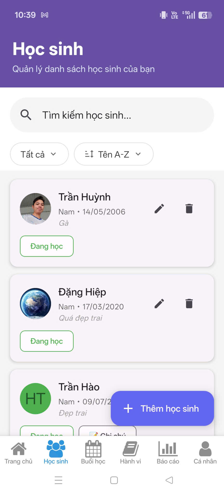
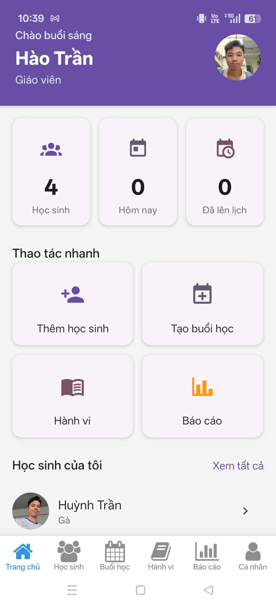
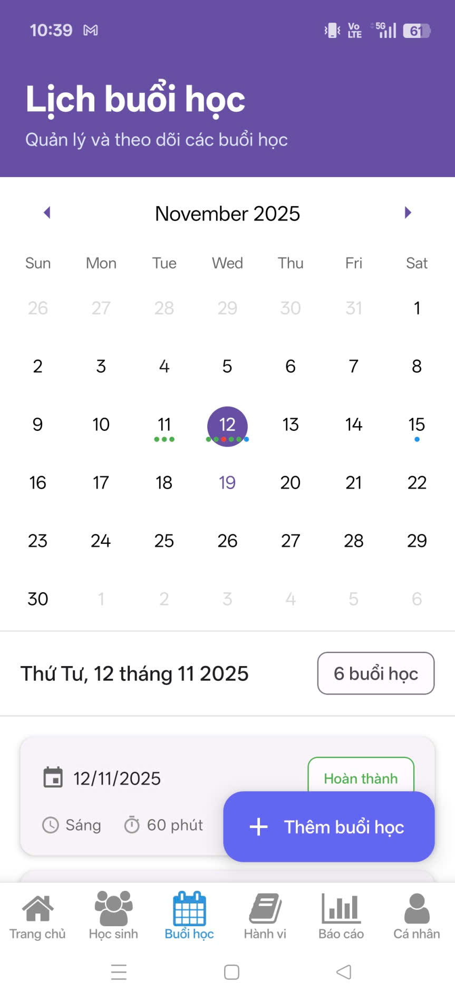
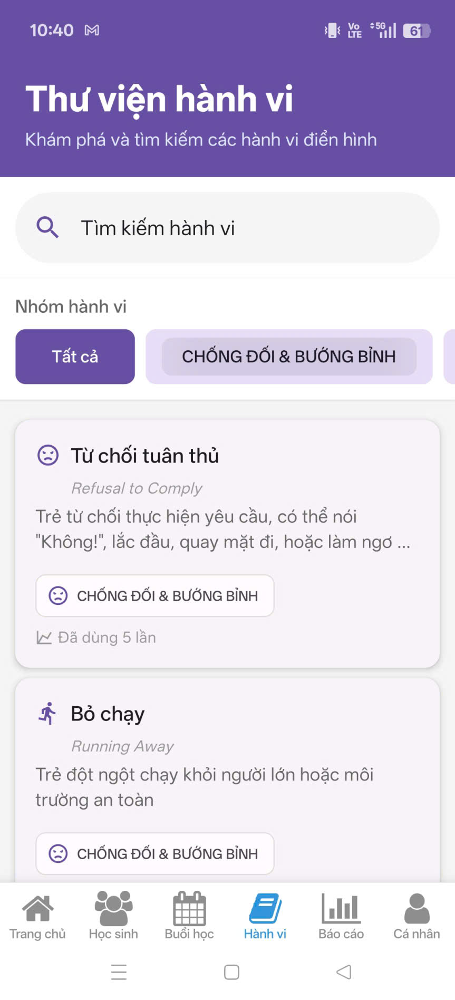
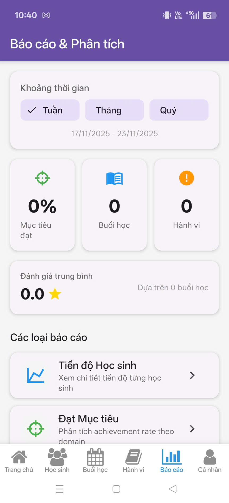
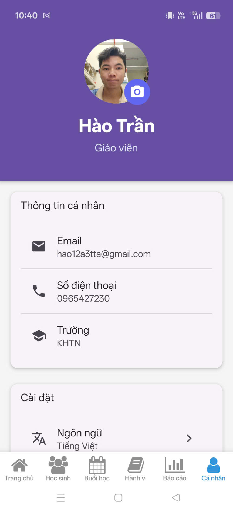
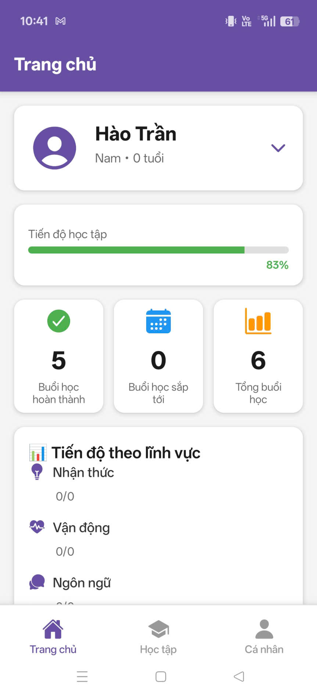
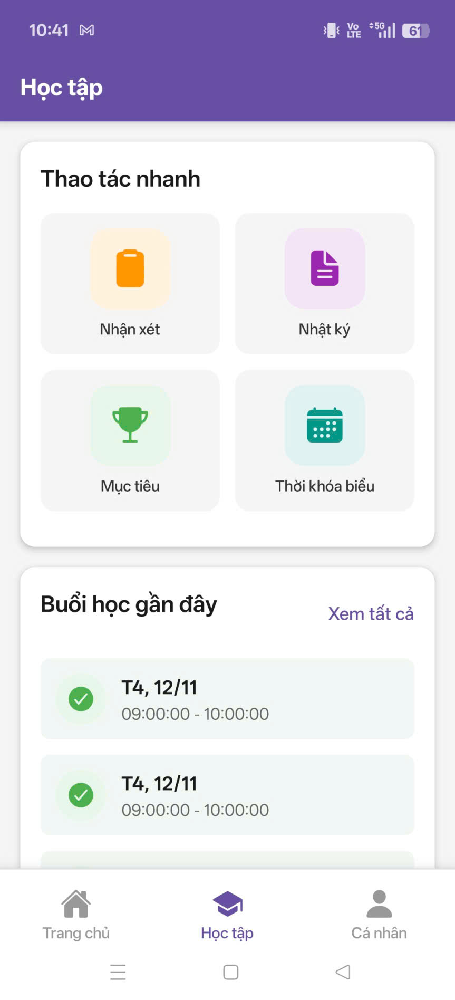
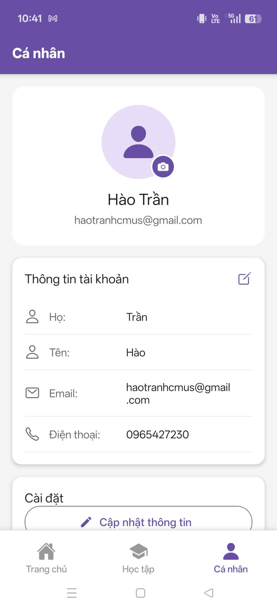

# 🎓 EduCare Connect

**EduCare Connect** là ứng dụng quản lý giáo dục đặc biệt dành cho giáo viên và phụ huynh, giúp theo dõi và đánh giá quá trình học tập của trẻ em có nhu cầu đặc biệt.

## ✨ Tính năng chính

### 👨‍🏫 Dành cho Giáo viên

- **Quản lý học sinh**: Thêm, chỉnh sửa thông tin học sinh
- **Tạo buổi học**: Lên kế hoạch và tổ chức buổi học với nội dung chi tiết
- **Ghi nhật ký buổi học**:
  - Đánh giá tâm trạng học sinh
  - Theo dõi hành vi (tích cực/tiêu cực)
  - Đánh giá mục tiêu học tập (tri thức, kỹ năng, hành vi)
  - Ghi chú và đính kèm hình ảnh/video
- **Mời phụ huynh**: Gửi lời mời qua email để phụ huynh theo dõi con
- **Báo cáo & thống kê**: Xem báo cáo tổng quan về tiến trình học tập













### 👪 Dành cho Phụ huynh

- **Theo dõi con**: Xem thông tin và lịch sử học tập của con
- **Xem nhật ký buổi học**: Chi tiết về từng buổi học, đánh giá, hình ảnh
- **Nhận thông báo**: Cập nhật kịp thời về hoạt động học tập của con







## 🛠️ Công nghệ sử dụng

- **Frontend**: React Native (Expo SDK 54)
- **Navigation**: Expo Router (file-based routing)
- **UI Library**: React Native Paper
- **State Management**: Zustand
- **Data Fetching**: TanStack Query (React Query)
- **Backend**: Supabase (PostgreSQL + Authentication + Storage)
- **Form Validation**: React Hook Form + Zod
- **Date Handling**: date-fns
- **Build**: EAS Build

## 📋 Yêu cầu hệ thống

- Node.js 18+
- npm hoặc yarn
- Expo CLI
- Android Studio (cho emulator) hoặc thiết bị Android
- Tài khoản Supabase

## 🚀 Hướng dẫn cài đặt

### 1. Clone repository

```bash
git clone <repository-url>
cd educare-connect
```

### 2. Cài đặt dependencies

```bash
npm install
```

### 3. Cấu hình môi trường

Tạo file `.env` trong thư mục gốc:

```env
EXPO_PUBLIC_SUPABASE_URL=your-supabase-url
EXPO_PUBLIC_SUPABASE_ANON_KEY=your-supabase-anon-key
```

**Lấy credentials từ Supabase:**

1. Truy cập [Supabase Dashboard](https://supabase.com/dashboard)
2. Chọn project → Settings → API
3. Copy `URL` và `anon/public key`

### 4. Setup Supabase Database

Chạy các file SQL trong thư mục `docs/setup/`:

```bash
# 1. Tạo schema
psql -h your-db-host -U postgres -d your-db-name -f docs/setup/schema.sql

# 2. Tạo RLS policies (nếu cần)
psql -h your-db-host -U postgres -d your-db-name -f docs/migrations/production-rls-students.sql
psql -h your-db-host -U postgres -d your-db-name -f docs/migrations/production-rls-goal-evaluations.sql
```

**Hoặc chạy trực tiếp trong Supabase SQL Editor:**

- Copy nội dung các file SQL
- Paste vào SQL Editor
- Execute

### 5. Cấu hình Supabase (Chi tiết trong `docs/SUPABASE_SETUP.md`)

#### Authentication Settings

1. Vào **Authentication → URL Configuration**
2. Thêm Redirect URLs:
   ```
   educareconnect://auth/confirmed
   educareconnect://auth/reset-password
   educareconnect://auth/email-changed
   educareconnect://auth/invite-accepted
   educareconnect://auth
   ```

#### Email Templates

Cập nhật các email templates (Vietnamese) - xem chi tiết trong `docs/SUPABASE_SETUP.md`

#### Storage Buckets

Tạo 2 buckets:

- `avatars` (public)
- `session-media` (public)

## 💻 Chạy ứng dụng

### Development Mode

```bash
# Start Expo dev server
npm start

# Hoặc chạy trực tiếp trên platform
npm run android  # Android
npm run ios      # iOS
npm run web      # Web
```

### Trên Thiết bị/Emulator

**Android:**

```bash
npm run android
```

**iOS (chỉ trên macOS):**

```bash
npm run ios
```

### Test với Expo Go

1. Cài đặt [Expo Go](https://expo.dev/client) trên điện thoại
2. Chạy `npm start`
3. Scan QR code bằng:
   - Android: Expo Go app
   - iOS: Camera app

## 📦 Build APK/AAB

### Cài đặt EAS CLI

```bash
npm install -g eas-cli
```

### Login vào Expo

```bash
eas login
```

### Configure Build

```bash
eas build:configure
```

### Build APK (Preview - Internal Testing)

```bash
eas build --platform android --profile preview
```

### Build Production

```bash
eas build --platform android --profile production
```

Build sẽ chạy trên cloud (~15-20 phút). Sau khi hoàn thành, bạn sẽ nhận được link download APK/AAB.

### Build Profiles

- **development**: Development client với debugging
- **preview**: APK để test nội bộ
- **production**: AAB để submit lên Google Play Store

## 📂 Cấu trúc dự án

```
educare-connect/
├── app/                      # Expo Router screens
│   ├── (auth)/              # Authentication screens
│   ├── (teacher)/           # Teacher screens
│   └── (parent)/            # Parent screens
├── src/
│   ├── components/          # Reusable components
│   ├── config/              # App configuration
│   ├── constants/           # Constants & enums
│   ├── hooks/               # Custom React hooks
│   ├── services/            # API services
│   ├── stores/              # Zustand stores
│   ├── types/               # TypeScript types
│   └── utils/               # Utility functions
├── assets/                  # Images, fonts, etc.
├── docs/                    # Documentation
│   ├── setup/              # Database setup
│   └── migrations/         # Database migrations
├── lib/                     # External libraries config
├── app.json                 # Expo configuration
├── eas.json                 # EAS Build configuration
└── package.json

```

## 🔐 Authentication Flow

### Giáo viên (Teacher)

1. Đăng ký tài khoản → Xác nhận email
2. Đăng nhập → Trang chủ giáo viên
3. Quản lý học sinh, tạo buổi học, ghi nhật ký

### Phụ huynh (Parent)

1. Nhận email mời từ giáo viên
2. Click link → Tạo mật khẩu
3. Đăng nhập → Xem thông tin con

## 🎨 Theme & Styling

App sử dụng Material Design 3 với React Native Paper:

- Primary Color: `#6750A4` (Purple)
- Accent Color: `#625B71`
- Background: Adaptive (Light/Dark mode)

## 🧪 Testing

### Run tests

```bash
npm test
```

### Check TypeScript

```bash
npm run type-check
```

### Lint

```bash
npm run lint
```

## 📖 Tài liệu bổ sung

- [Supabase Setup Guide](./docs/SUPABASE_SETUP.md) - Cấu hình Supabase chi tiết
- [Build APK Guide](./docs/BUILD_APK.md) - Hướng dẫn build APK
- [Pre-Build Checklist](./docs/PRE_BUILD_CHECKLIST.md) - Checklist trước khi build production

## 🐛 Troubleshooting

### App crash khi mở

- Kiểm tra `.env` file có đầy đủ credentials không
- Kiểm tra Supabase URL và key có đúng không
- Xem logs: `adb logcat | grep ReactNativeJS`

### Deep link không hoạt động

- Kiểm tra scheme trong `app.json`: `educareconnect://`
- Kiểm tra Redirect URLs trong Supabase Dashboard
- Test deep link: `adb shell am start -W -a android.intent.action.VIEW -d "educareconnect://auth"`

### Build fail

- Chạy `npm install` lại
- Clear cache: `expo start -c`
- Kiểm tra `eas.json` configuration

## 🤝 Contributing

1. Fork repository
2. Tạo branch mới: `git checkout -b feature/AmazingFeature`
3. Commit changes: `git commit -m 'Add some AmazingFeature'`
4. Push to branch: `git push origin feature/AmazingFeature`
5. Open Pull Request

## 📝 License

This project is licensed under the MIT License.

## 👥 Team

- **Developer**: [Your Name]
- **Project Type**: Educational Management for Special Needs Children
- **Contact**: support@educareconnect.com

## 🙏 Acknowledgments

- [Expo](https://expo.dev/) - React Native framework
- [Supabase](https://supabase.com/) - Backend as a Service
- [React Native Paper](https://reactnativepaper.com/) - Material Design components
- [TanStack Query](https://tanstack.com/query) - Data fetching & caching

---

Made with ❤️ for special education
